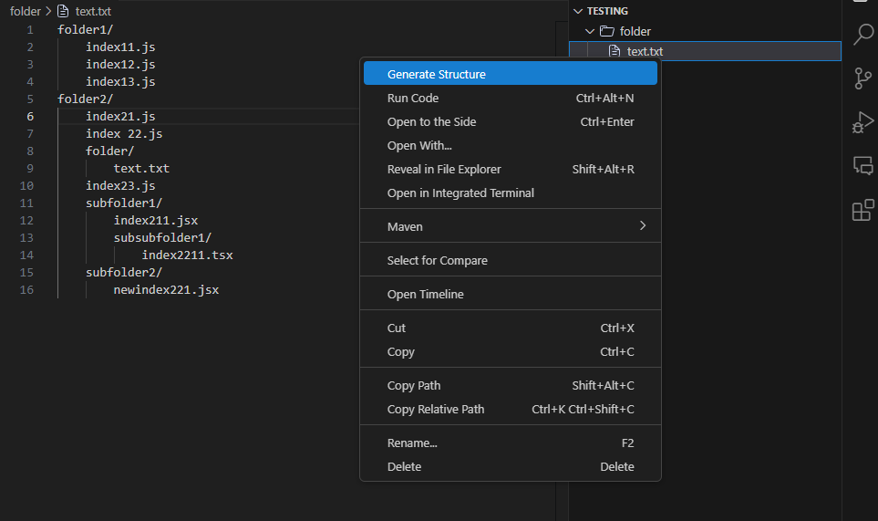

# dfoldergen README

## -How to use?
Create any .txt file with a folder/file structure. Right-click on it and select "Generate Structure". It will generate the files in the format you specified in the same folder as the .txt file.

Alternatively, press Ctrl+Shift+P to bring up the command palette and select "Generate Structure". It will ask for a .txt file with the defined structure and a destination folder.

## -Why it exists?
I just started learning NEXT.js and got annoyed with clicking around to make new folder structures. I would rather write them out all at once while thinking rather than adding the buffer of clicking icons :/

## Features
Generate Folder Structure: Create folders and files from a .txt file with a specified folder/file structure.
Quick Access: Right-click on a .txt file and select "Generate Structure", or use the Command Palette for more options.
Custom Folder/File Format: Specify the folder/file structure in a .txt file using indentation to define hierarchy.

## Example of a .txt

src/
    index.js
    [id]/
        page.tsx
    newfile.bat
public/
    image.tsx
    hello.js

# Context Menu

## Requirements

This extension does not have any external dependencies, but you will need the following:

VS Code: This extension works in VS Code (version 1.50 or later).
Node.js: The extension is developed with TypeScript and Node.js. Make sure you have Node.js 14 or later installed on your system to run the extension.

## Extension Settings

Currently, this extension does not contribute any settings through the contributes.configuration extension point.

## Known Issues

File Creation: If there are issues with permissions, the extension may fail to create files or folders in certain directories.
Icons in Context Menu: The custom icon might not always appear in the right-click context menu depending on the VS Code version.

## Release Notes

## 1.0.0:
Initial Release: The first version of the extension that allows you to generate folder and file structures from a .txt file.
## 1.0.1:
Bug Fix: Fixed an issue where the extension would generate all files in the same directory level, not respecting indentation.
## 1.1.0:
Feature Added: Now supports generating the folder structure from the Command Palette and offers destination folder selection.

---

